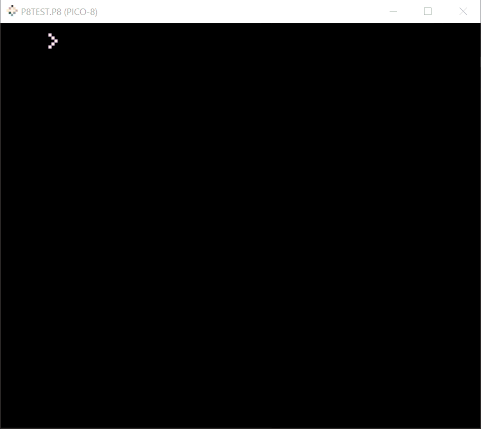
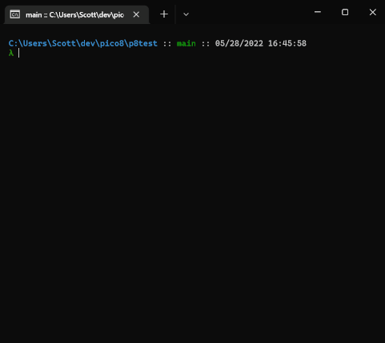

# P8Test

**P8Test** is a tiny test framework for Pico-8. I almost hesitate to call it that because it seems grander than it
really is. It's really just a template for how I like to write some of my pico-8 game tests.

P8Test helps you setup a small pico-8 cartridge file which will can run through some unit tests and either print
the results in the pico-8 window or directly to your console

## Demo

Here's a demo outputting to the pico-8 console



Here's a demo outputting to your own console



## How to

### Setup P8Test

P8Test is unceremoniously simple. All you need to do is download the `p8test` folder from this repo and then setup

1. Download the `p8test` folder to your pico8 game's working directory
2. Copy `p8test.p8` to your pico8 game's working directory or create your own test runner cart with whatever name
3. Modify the test runner cart so it follows the structure of `p8test.p8`
  ```
  pico-8 cartridge // http://www.pico-8.com
  version 35
  __lua__
  -- the game code being tested goes here
  #include <path to your game code here>

  -- DO NOT MODIFY: include the test utilities before the user defined tests
  #include p8test/testutils.lua

  -- the user-provided tests go here
  #include <path to your tests here>

  -- DO NOT MODIFY: include the test driver last
  #include p8test/testmain.lua
  ```
4. write some tests
5. run the test runner cart! Either:
    * open up the cart in pico8 and use the `run` command
    * run the cart in headless mode with `pico8 -x your_test_cart.p8` from the command line

### Write a P8Test

Writing tests is straight forward.

1. write a function which tests the behavior you want to test
   * the test should signal a failure by returning a string which describes the failure
   * the test should signal a success by returning a `nil`
   * check out the example tests in [example_game_tests.lua](example_game\example_game_tests.lua)
2. add it to the test list using the `add_test` function
